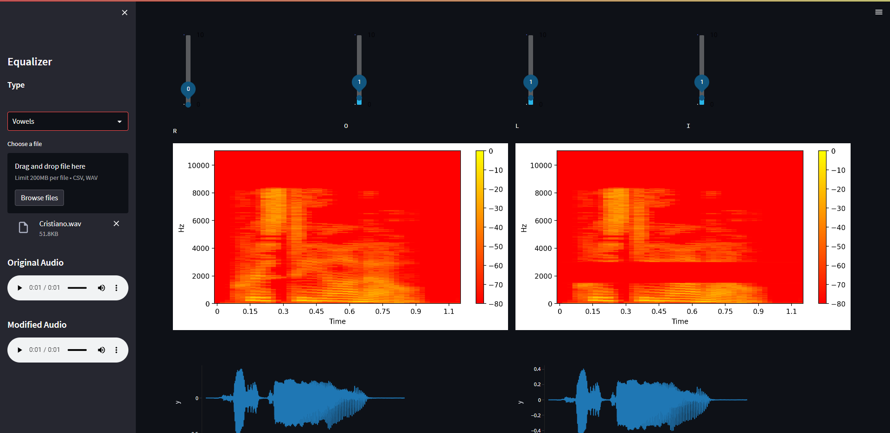
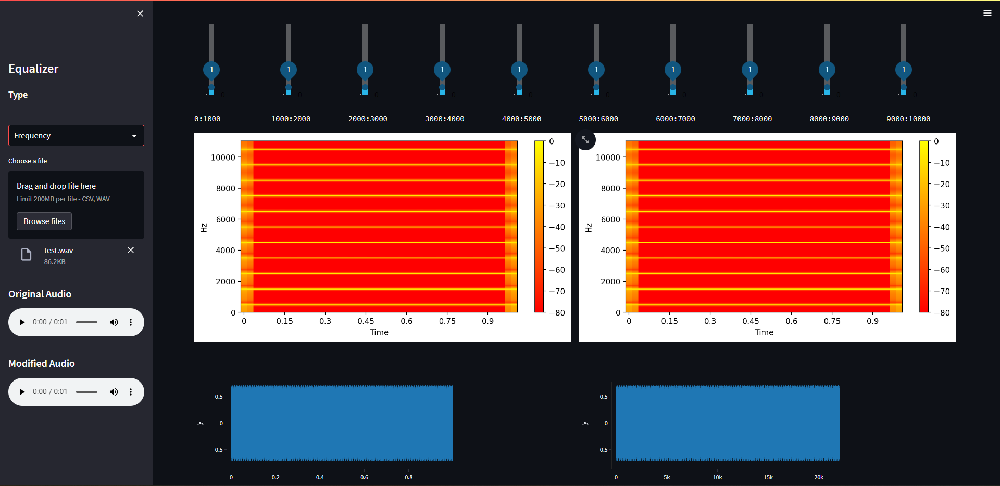
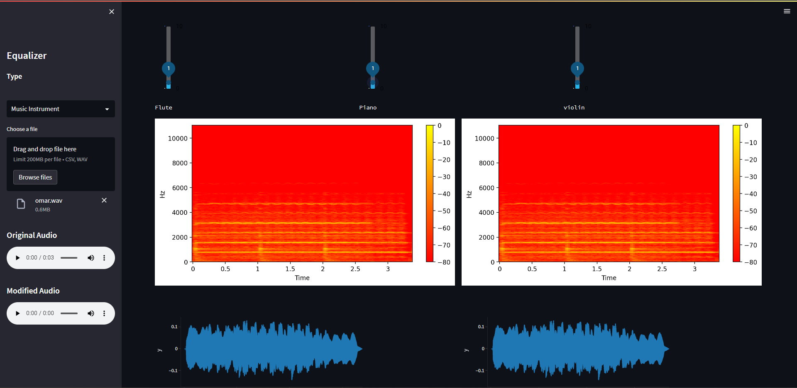

# Signal equalizer, vowel enhancement, Music instrument emphasizer, and ECG classifier
An equilizer with different modes and special uses
- ability to aupload audio files, and csv files(for medical abnormalities)
- a regular mode with the ability to modify intensities of fixed frequencies
- phonetics mode to adjust the intensities for some letters
- a mode specifically for some musical instruments
- a mode for medical abnormalities
- the ability to play the audio before and after the equilizer settings (except the medical abnormalities)
- for all modes, a spectrogram for the data before and after applying the equilizer settings
- for all modes, a plot for intensities aganist time before and after applying equilizer settings

#Preview
- 
- 
- 
